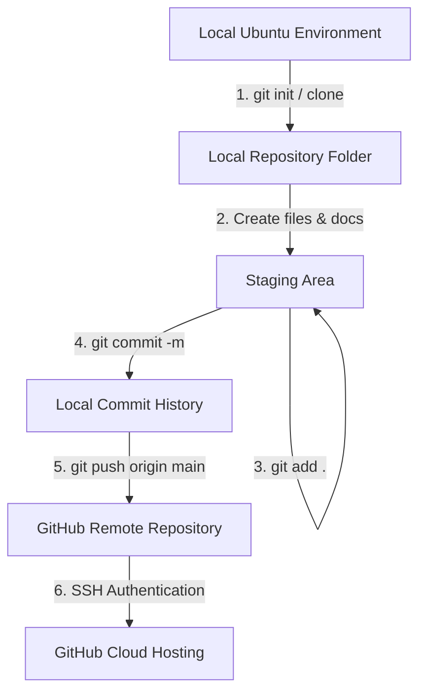

# DevOps Workflow Diagram

This document details the local-to-remote Git and GitHub repository workflow established for Task 1.

## Architecture Summary
* **OS Environment:** Ubuntu 26.04 LTS
* **Version Control System:** Git
* **Authentication Method:** SSH Public/Private Keypair
* **Remote Host:** GitHub (`https://github.com/NabeelaNisa/Cloud-DevOps-Intership`)
